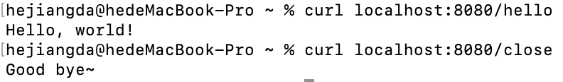
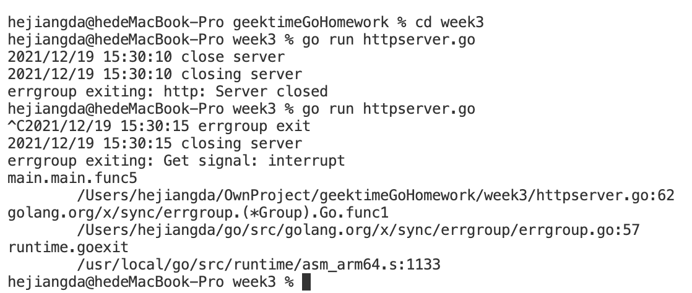

1. 基于 errgroup 实现一个 http server 的启动和关闭 ，以及 linux signal 信号的注册和处理，要保证能够一个退出，全部注销退出。

答：总共开了三个 goroutine，用一个 goroutine 启动 http server，一个根据同步channel返回的结果关闭 http server，最后一个监听系统的信号，当收到关闭信号的时候关闭三个 goroutine

运行结果截图：

